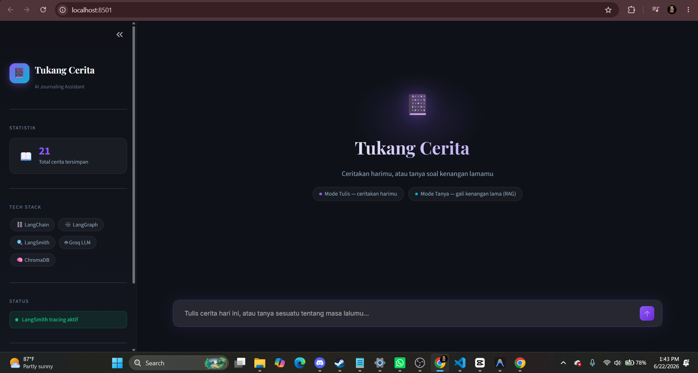
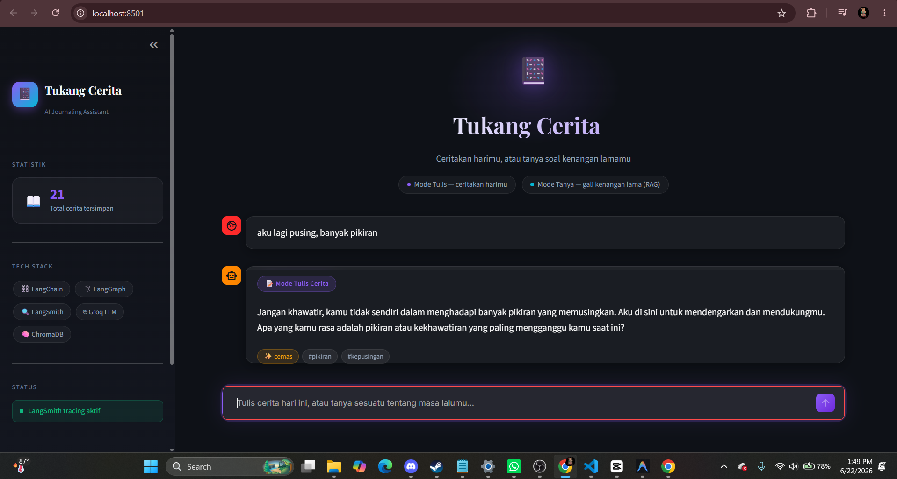
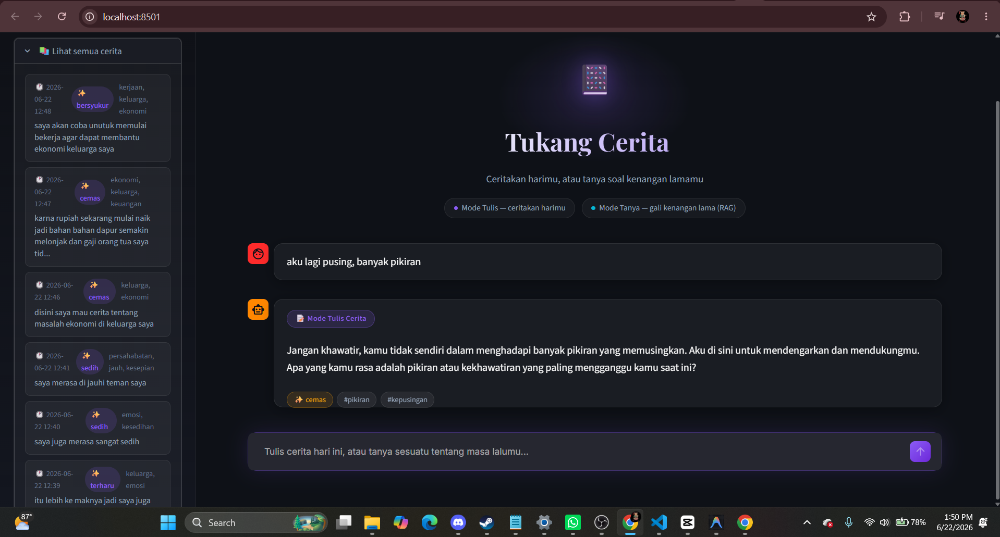

# 📔 Tukang Cerita — Journaling Bot dengan Memory

Sistem journaling pribadi berbasis NLP/LLM yang bisa **mengingat** entri-entri cerita lama dan **mengajak ngobrol reflektif** tentang isinya. Dibangun untuk memenuhi tugas UAS Natural Language Processing dengan menggunakan **LangChain**, **LangGraph**, dan **LangSmith**.

> Tugas: Ujian Akhir Semester — Mata Kuliah Natural Language Processing

---

## ✨ Fitur

- **Tulis cerita harian** lewat chat — bot otomatis mendeteksi mood & topik dari tulisanmu.
- **Tanya jawab reflektif** soal entri-entri lama ("gimana mood aku minggu lalu soal kerjaan?") menggunakan **RAG (Retrieval-Augmented Generation)**.
- **Memory jangka panjang**: setiap entri disimpan sebagai embedding di vector store, bukan cuma riwayat chat sesi itu saja.
- **Routing otomatis** antara mode "tulis" dan "tanya" — sepenuhnya ditangani oleh agent graph, bukan if-else manual di UI.
- **100% gratis & tanpa install model besar** — LLM lewat Groq (cloud), embedding lewat HuggingFace Inference API (cloud). Cukup API key gratis, tidak perlu GPU atau download model raksasa.

---

## 🧠 Cara Kerja Library Wajib

### 1. LangChain
Digunakan sebagai lapisan integrasi LLM dan prompt engineering:
- `ChatGroq` — koneksi ke LLM (model open-source Llama, di-hosting gratis & cepat oleh Groq)
- `ChatPromptTemplate` — template prompt untuk klasifikasi intent, analisis mood, generate respons, dan jawaban RAG (lihat `chains/prompts.py`)
- `HuggingFaceEndpointEmbeddings` + `Chroma` — vector store untuk menyimpan & mencari entri cerita secara semantik (lihat `memory/vectorstore.py`)
- LCEL (`prompt | llm | parser`) — menyusun chain klasifikasi mood (lihat `chains/mood_classifier.py`)

### 2. LangGraph
Mengatur **alur kerja agent** sebagai sebuah *state graph* (lihat `graph/builder.py`):

```
START
  │
  ▼
classify_intent  ──┬─(intent="tulis")──▶ write_journal ──▶ journal_response ──▶ END
                    │
                    └─(intent="tanya")──▶ retrieve_context ──▶ rag_answer ──▶ END
```

- **State** (`graph/state.py`) membawa data antar node (input user, mood, tags, konteks hasil retrieval, dsb).
- **Conditional edge** (`route_by_intent`) menentukan cabang mana yang dieksekusi berdasarkan hasil klasifikasi intent — ini bagian inti yang membedakan LangGraph dari sekadar chain linear LangChain biasa.

### 3. LangSmith
Setiap pemanggilan LLM dan setiap langkah graph otomatis ter-trace ke dashboard LangSmith (cukup dengan mengisi `LANGSMITH_API_KEY` di `.env` — tidak ada kode tambahan yang dibutuhkan, lihat `config.py`). Tracing dipakai untuk:
- Debugging kenapa bot mengklasifikasikan intent tertentu
- Melihat latency tiap node
- Mengevaluasi kualitas jawaban RAG dibanding entri cerita yang di-retrieve

> 📸 *(Tambahkan screenshot dashboard LangSmith di sini saat submit)*

---

## 🖼️ Screenshot





## 🛠️ Tech Stack

| Komponen | Teknologi | Catatan |
|---|---|---|
| Orkestrasi LLM | LangChain | — |
| Agent workflow | LangGraph | — |
| Observability | LangSmith | — |
| LLM | **Groq** (model `llama-3.3-70b-versatile`) | Gratis, cloud, cepat |
| Embedding | **HuggingFace Inference API** (`all-MiniLM-L6-v2`) | Gratis, cloud, tidak perlu download model |
| Vector store | ChromaDB | Lokal (file-based) |
| Metadata storage | SQLite | Lokal (file-based) |
| UI | Streamlit | — |

---

## 🚀 Cara Menjalankan

### 1. Prasyarat
- Python 3.10+
- Koneksi internet (LLM & embedding berjalan via API cloud gratis)

### 2. Buat API key gratis
- **Groq**: daftar di [console.groq.com](https://console.groq.com) → buat API key (gratis, tanpa kartu kredit)
- **HuggingFace**: daftar di [huggingface.co](https://huggingface.co) → Settings → Access Tokens → buat token baru (gratis)
- **LangSmith** (opsional tapi disarankan untuk demo tracing): daftar di [smith.langchain.com](https://smith.langchain.com)

### 3. Clone repository & masuk ke folder project
```bash
git clone <url-repo-ini>
cd tukang-cerita
```

### 4. Buat virtual environment & install dependency
```bash
python -m venv venv
source venv/bin/activate   # Windows: venv\Scripts\activate
pip install -r requirements.txt
```

### 5. Setup environment variables
```bash
cp .env.example .env
```
Lalu isi `.env` dengan API key yang sudah dibuat di langkah 2:
```
GROQ_API_KEY=isi-disini
HUGGINGFACEHUB_API_TOKEN=isi-disini
LANGSMITH_API_KEY=isi-disini
```

### 6. Jalankan aplikasi
```bash
streamlit run app.py
```

Aplikasi akan terbuka di `http://localhost:8501`. Tidak perlu menjalankan server tambahan apa pun — semua LLM call langsung lewat API cloud.

---

## 📁 Struktur Project

```
tukang-cerita/
├── app.py                     # Entry point Streamlit UI
├── config.py                  # Setup environment & LangSmith
├── requirements.txt
├── .env.example
├── graph/
│   ├── state.py                # Definisi JurnalState (TypedDict)
│   ├── nodes.py                 # Semua node function LangGraph
│   └── builder.py               # Penyusunan StateGraph + conditional edges
├── chains/
│   ├── prompts.py               # Semua ChatPromptTemplate
│   └── mood_classifier.py       # Contoh chain LCEL (prompt | llm | parser)
└── memory/
    ├── vectorstore.py           # Setup Chroma + embedding (RAG)
    └── journal_store.py         # Penyimpanan metadata entri (SQLite)
```

---

## 🎥 Video Demo

Link video penjelasan (teori LangChain/LangGraph/LangSmith + demo project): **[isi link Google Drive di sini]**

---

## 👤 Author

Dibuat oleh [Nama Mahasiswa] — NIM [isi NIM] — untuk UAS Natural Language Processing.
